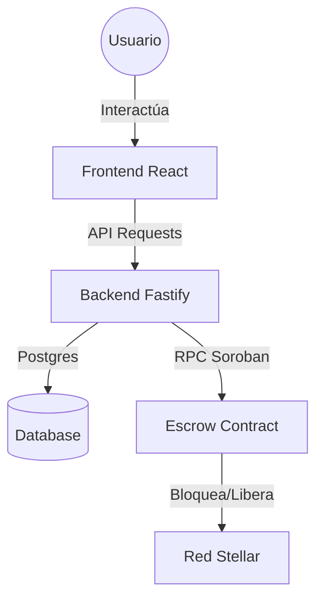

# 🍄 Micopay: Emerald Horizon

**Micopay** es un protocolo de intercambio P2P descentralizado que conecta el mundo del efectivo con el ecosistema de **Stellar & Soroban**. Nuestra misión es democratizar el acceso a las finanzas digitales permitiendo que cualquier persona retire o deposite fondos a través de una red confiable de agentes locales.


## 🌟 Visión del Proyecto
En mercados emergentes, la "última milla" de las criptomonedas es el efectivo. Micopay elimina la dependencia de bancos tradicionales mediante el uso de **Contratos Escrow (HTLC)** autogestionados, garantizando que el usuario siempre tenga el control de sus fondos.

## 🛠️ Stack Tecnológico
- **Blockchain**: Stellar Network & Soroban Smart Contracts (Rust).
- **Frontend**: React 19 + Vite + Tailwind CSS v4 (Diseño Premium "Emerald Horizon").
- **Backend (Live)**: Fastify (Node.js) en [Render](https://micopay-api.onrender.com).
- **Base de Datos**: PostgreSQL para persistencia de reputación y estados.

## 🏗️ Arquitectura del Sistema


## 🚀 Guía de Showcase (Local Demo)

Para mostrar el potencial de Micopay en este hackatón, configuramos un entorno que permite probar los flujos completos de **Retiro** y **Depósito** en menos de 2 minutos.

### 1. Iniciar App (Modo Rápido)
Si quieres probar la versión conectada a la API real, solo necesitas correr el frontend:
```bash
cd micopay/frontend
npm install
# Asegúrate de configurar VITE_API_URL=https://micopay-api.onrender.com en tu .env o Vercel
npm run dev
```

## 🔒 Seguridad: Smart Escrow (HTLC) & QR

La confianza en Micopay no depende de los intermediarios, sino de la criptografía. Utilizamos un sistema de **Hash Time-Locked Contracts (HTLC)** implementado en **Soroban (Stellar Smart Contracts)**.

### ¿Cómo funciona el Escrow?
1.  **`lock(secret_hash)`**: Cuando se inicia un trade, el Vendedor bloquea los fondos en el contrato. El backend genera un **Secreto Aleatorio** y guarda su **Hash** on-chain.
2.  **`release(secret)`**: Para liberar los fondos, el Comprador debe presentar el **Secreto original**. El contrato verifica que `sha256(secreto) == hash_guardado` y transfiere los fondos.
3.  **`refund()`**: Si el intercambio no sucede tras el tiempo pactado, el Vendedor recupera sus fondos de forma segura.

### El Rol del Código QR
El QR en Micopay **ES el Secreto (Preimage)**. El usuario es el único que posee la "llave" para liberar el dinero del contrato inteligente una vez que recibe el efectivo físico.


---

### Documentación Técnica
-   **Contrato Soroban**: [lib.rs](file:///C:/Users/eric/Desktop/HACKATON/micopay/contracts/escrow/src/lib.rs)
-   **Arquitectura Core**: [micopay_backend_v1.3(1).md](file:///C:/Users/eric/Desktop/HACKATON/micopay_backend_v1.3(1).md)
-   **Demo Visual**: [Walkthrough de Usuario](file:///C:/Users/eric/.gemini/antigravity/brain/eccb3bf5-8e77-4c92-8e00-dc1b58078d91/walkthrough.md)

---
*Desarrollado con ❤️ para el Stellar Hackatón 2024.*
